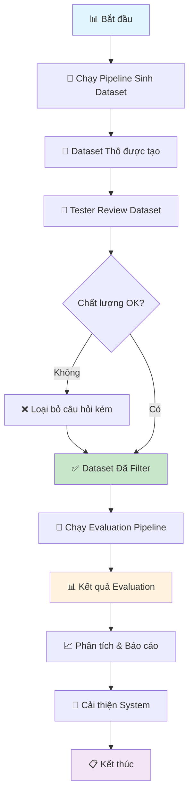

# 📋 Hướng Dẫn Quy Trình Sinh Data và Evaluation cho RAG System

## 🎯 Tổng Quan

Document này hướng dẫn chi tiết quy trình sinh dataset và evaluation cho RAG system, bao gồm:
- Quy trình sinh dataset tự động
- Hướng dẫn review và filter data cho tester
- Quy trình chạy evaluation
- Phân tích kết quả và tạo báo cáo

## 🔄 Quy Trình Tổng Thể



## 📚 Chi Tiết Từng Bước

### Bước 1: 🤖 Sinh Dataset Tự Động

#### 🎯 Mục đích
- Tạo ra dataset evaluation cho RAG system
- Sinh câu hỏi và câu trả lời expected từ document corpus
- Tạo test cases với độ khó và loại câu hỏi khác nhau

#### 🛠️ Cách thực hiện

**1.1. Chạy script sinh dataset:**
```bash
python generate_dataset.py
```

**1.2. Cấu hình sinh dataset:**
- Số lượng câu hỏi: 100-500 (tùy theo nhu cầu)
- Loại câu hỏi: factual, reasoning, summarization
- Độ khó: easy, medium, hard
- Document sources: tất cả documents trong corpus

**1.3. Output:**
- File: `evaluation_dataset_YYYYMMDD_HHMMSS.json`
- Format:
```json
[
  {
    "id": "test_001",
    "question": "Câu hỏi được sinh tự động",
    "expected_answer": "Câu trả lời mong đợi",
    "expected_context": "Context liên quan",
    "question_type": "factual",
    "difficulty": "medium",
    "document_id": "doc_123",
    "metadata": {...}
  }
]
```

#### ⏱️ Thời gian ước tính
- 100 câu hỏi: ~5-10 phút
- 500 câu hỏi: ~20-30 phút

---

### Bước 2: 👥 Review và Filter Dataset (Dành cho Tester)

#### 🎯 Mục đích
- Đảm bảo chất lượng dataset
- Loại bỏ câu hỏi không phù hợp
- Tạo dataset sạch cho evaluation

#### 🛠️ Cách thực hiện

**2.1. Chạy tool review:**
```bash
python review_dataset.py
```

**2.2. Chọn mode review:**
- **Interactive Mode (1)**: Review từng câu một cách tương tác
- **Auto Filter Mode (2)**: Tự động filter theo tiêu chí cơ bản

#### 📋 Hướng Dẫn Interactive Review

**2.3. Giao diện review:**
```
================================================================================
📋 Câu hỏi 1/100
================================================================================
🆔 ID: test_001
📝 Loại: factual | Độ khó: medium
📄 Document: doc_123

❓ CÂU HỎI:
   What is the main purpose of the RAG system?

💡 TRẢ LỜI MONG ĐỢI:
   The main purpose of the RAG system is to combine retrieval...

📖 CONTEXT:
   RAG (Retrieval-Augmented Generation) systems are designed...
================================================================================

🎯 HƯỚNG DẪN:
  k = Keep (Giữ lại)
  r = Remove (Loại bỏ)
  s = Skip (Bỏ qua)
  b = Back (Quay lại câu trước)
  q = Quit (Thoát và lưu)
  h = Help (Hướng dẫn chi tiết)

👉 Quyết định của bạn (k/r/s/b/q/h):
```

#### ✅ Tiêu Chí Giữ Lại (Keep)

**Chọn 'k' khi:**
- ✅ Câu hỏi rõ ràng, dễ hiểu
- ✅ Có thể trả lời dựa trên context được cung cấp
- ✅ Câu trả lời expected hợp lý và chính xác
- ✅ Phù hợp với domain knowledge
- ✅ Có giá trị cho việc evaluation
- ✅ Không duplicate với câu hỏi khác

**Ví dụ câu hỏi TỐT:**
```
❓ "What are the key benefits of using vector databases in RAG systems?"
💡 "Vector databases provide fast similarity search, scalable storage..."
📖 Context có thông tin đầy đủ về vector databases
```

#### ❌ Tiêu Chí Loại Bỏ (Remove)

**Chọn 'r' khi:**
- ❌ Câu hỏi mơ hồ, khó hiểu
- ❌ Không thể trả lời từ context
- ❌ Câu trả lời sai hoặc không chính xác
- ❌ Quá đơn giản (yes/no) hoặc quá phức tạp
- ❌ Duplicate với câu hỏi khác
- ❌ Không phù hợp với mục đích evaluation
- ❌ Chứa thông tin nhạy cảm

**Ví dụ câu hỏi KÉM:**
```
❓ "What is this?" (quá mơ hồ)
❓ "Is RAG good?" (quá đơn giản)
❓ "Explain quantum computing in detail" (không liên quan đến context)
```

#### 📊 Mục Tiêu Quality

- **Tỷ lệ giữ lại tối ưu:** 70-80%
- **Số lượng câu hỏi cuối:** ít nhất 50 câu
- **Phân bố loại câu hỏi:** cân bằng giữa các loại
- **Phân bố độ khó:** 40% easy, 40% medium, 20% hard

**2.4. Output sau review:**
- `filtered_dataset_YYYYMMDD_HHMMSS.json`: Dataset đã filter
- `removed_items_YYYYMMDD_HHMMSS.json`: Các items bị loại
- `review_report_YYYYMMDD_HHMMSS.txt`: Báo cáo chi tiết

#### ⏱️ Thời gian ước tính
- 100 câu hỏi: ~30-60 phút (interactive)
- Auto filter: ~1-2 phút

---

### Bước 3: 🧪 Chạy Evaluation Pipeline

#### 🎯 Mục đích
- Đánh giá performance của RAG system
- Tính toán metrics chi tiết
- Phân tích lỗi và điểm yếu

#### 🛠️ Cách thực hiện

**3.1. Chạy evaluation:**
```bash
python run_evaluation.py
```

**3.2. Chọn dataset:**
- Script sẽ tự động tìm file filtered dataset mới nhất
- Hoặc nhập tên file cụ thể

**3.3. Quá trình evaluation:**
```
🚀 KHỞI TẠO EVALUATION PIPELINE
==================================================
✅ Đã load 85 test cases từ filtered_dataset_20241201_143022.json
📊 Sẽ evaluate 85 test cases
🔧 Khởi tạo evaluator...
✅ Evaluator đã sẵn sàng (Mock mode)
🧪 Bắt đầu evaluation...

📊 Đang evaluate test case 1/85: test_001
📊 Đang evaluate test case 2/85: test_002
...
✅ Evaluation hoàn thành trong 12.45 giây
```

#### 📊 Metrics được tính toán

**Retrieval Metrics:**
- **Precision@5**: Độ chính xác của top-5 documents
- **Recall@5**: Tỷ lệ recall trong top-5 results
- **MRR (Mean Reciprocal Rank)**: Thứ hạng trung bình của document đúng

**Generation Metrics:**
- **Faithfulness**: Độ trung thực với context
- **Relevance**: Độ liên quan đến câu hỏi
- **Quality**: Chất lượng tổng thể của câu trả lời

**Performance Metrics:**
- **Retrieval Time**: Thời gian truy vấn vector DB
- **Generation Time**: Thời gian sinh câu trả lời
- **Total Time**: Tổng thời gian xử lý

**3.4. Output:**
- `evaluation_report_YYYYMMDD_HHMMSS.json`: Kết quả chi tiết
- `summary_report_YYYYMMDD_HHMMSS.md`: Báo cáo tóm tắt
- `evaluation_data_YYYYMMDD_HHMMSS.csv`: Data để phân tích

#### ⏱️ Thời gian ước tính
- 50 test cases: ~5-10 phút
- 100 test cases: ~10-20 phút

---

### Bước 4: 📈 Phân Tích Kết Quả & Tạo Dashboard

#### 🎯 Mục đích
- Visualize kết quả evaluation
- Phân tích performance theo nhiều góc độ
- Tạo báo cáo cho team

#### 🛠️ Cách thực hiện

**4.1. Tạo dashboard:**
```bash
python create_dashboard.py
```

**4.2. Chọn loại dashboard:**
- **Single Dashboard (1)**: Cho một lần evaluation
- **Comparison Dashboard (2)**: So sánh nhiều lần evaluation

**4.3. Dashboard bao gồm:**

📊 **Overall Performance:**
- Success rate pie chart
- Metrics overview bar chart
- Response time analysis

📈 **Detailed Analysis:**
- Performance by question type
- Performance by difficulty level
- Failure reason analysis

🔥 **Advanced Visualizations:**
- Performance heatmap
- Score distribution histograms
- Trend analysis (nếu có nhiều evaluations)

**4.4. Output:**
- `evaluation_dashboard_YYYYMMDD_HHMMSS.png`: Dashboard image
- `comparison_dashboard_YYYYMMDD_HHMMSS.png`: Comparison charts

#### ⏱️ Thời gian tạo dashboard
- Single dashboard: ~30-60 giây
- Comparison dashboard: ~1-2 phút

---

## 🎯 Checklist cho Tester

### ✅ Trước khi bắt đầu
- [ ] Đã có dataset thô từ generate_dataset.py
- [ ] Hiểu rõ tiêu chí đánh giá chất lượng
- [ ] Có đủ thời gian để review (ước tính 30-60 phút cho 100 câu)

### ✅ Trong quá trình review
- [ ] Kiểm tra câu hỏi có rõ ràng không
- [ ] Xác nhận câu trả lời có chính xác không
- [ ] Đảm bảo context có đủ thông tin để trả lời
- [ ] Ghi chú lý do khi loại bỏ câu hỏi
- [ ] Maintain tỷ lệ keep/remove hợp lý (70-80% keep)

### ✅ Sau khi review
- [ ] Kiểm tra báo cáo review
- [ ] Xác nhận số lượng câu hỏi cuối cùng (≥50)
- [ ] Chạy evaluation pipeline
- [ ] Tạo và kiểm tra dashboard

---

## 🚨 Troubleshooting

### ❌ Lỗi thường gặp

**1. "Không tìm thấy file dataset"**
```bash
# Kiểm tra file có tồn tại
ls -la evaluation_dataset_*.json

# Chạy lại generate dataset nếu cần
python generate_dataset.py
```

**2. "Dataset trống sau review"**
```bash
# Kiểm tra tiêu chí review có quá strict không
# Chạy auto filter trước
python review_dataset.py
# Chọn option 2 (Auto Filter)
```

**3. "Evaluation thất bại"**
```bash
# Kiểm tra dependencies
pip install -r requirements.txt

# Kiểm tra RAG system có hoạt động không
python -c "from src.experts.rag_bot.expert import create_rag_bot_expert; print('OK')"
```

**4. "Dashboard không tạo được"**
```bash
# Cài đặt visualization dependencies
pip install matplotlib seaborn pandas numpy
```

### 💡 Tips tối ưu

**Cho Tester:**
- Bắt đầu với auto filter để loại bỏ cases rõ ràng kém
- Focus vào chất lượng hơn là tốc độ
- Sử dụng 'h' để xem help khi cần
- Sử dụng 's' (skip) cho cases không chắc chắn, quay lại sau

**Cho Team Lead:**
- Chạy evaluation định kỳ để track performance
- So sánh results giữa các versions
- Focus vào failure analysis để cải thiện system
- Sử dụng CSV output để deep dive analysis

---

## 📊 Mẫu Báo Cáo Cuối

### 📈 Executive Summary
- **Dataset Size**: 85 test cases (từ 120 ban đầu)
- **Success Rate**: 78.8%
- **Key Metrics**: Precision@5: 0.845, Faithfulness: 0.823
- **Performance**: Avg response time 1.2s

### 🔍 Key Findings
- Factual questions perform best (85% success)
- Hard difficulty questions need improvement (65% success)
- Main failure: retrieval không tìm đúng context

### 💡 Recommendations
1. Cải thiện retrieval algorithm cho hard questions
2. Fine-tune generation model cho faithfulness
3. Tăng size của vector database
4. Optimize query preprocessing

### 🔄 Next Steps
1. Implement recommendations
2. Re-run evaluation sau 1 tuần
3. A/B test với user queries thực tế
4. Scale up dataset size lên 500 test cases

---

## 📞 Hỗ Trợ

**Liên hệ:**
- Tech Lead: [tên] - [email]
- QA Lead: [tên] - [email]

**Resources:**
- Confluence: [link]
- Slack Channel: #rag-evaluation
- Jira Board: [link]

---

*Document version: 1.0*  
*Last updated: [ngày tháng]*  
*Next review: [ngày tháng]* 