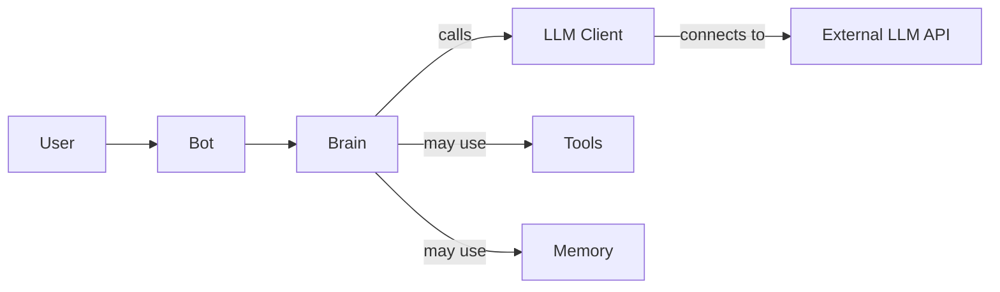

# LLM Backend Framework

A modular backend framework for building AI applications with large language models (LLMs), FastAPI, and MongoDB.

📚 **Developer docs available in the [docs/](./docs/) folder.**

## Project Structure

The project is organized using the Bot-Brain architecture with standardized interfaces:

```
├── api/                  # API layer with FastAPI
│   └── v1/               # Versioned APIs
│       ├── chat.py       # Chat endpoints
│       ├── health.py     # Health check endpoints
│       └── __init__.py   # API initialization
├── src/                  # Source code
│   ├── bot/              # Bot implementation
│   │   ├── __init__.py   # Bot module initialization
│   │   └── bot.py        # Main Bot class
│   ├── reasoning/        # Reasoning components
│   │   ├── __init__.py   # Reasoning module initialization
│   │   ├── brains/       # LLM-powered reasoning
│   │   │   ├── base.py   # BaseBrain abstract class
│   │   │   ├── openai_brain.py # Brain using OpenAI LLM
│   │   │   ├── llama_brain.py # Brain using LlamaCpp
│   │   │   ├── brain_factory.py # Factory to choose correct brain
│   │   │   └── __init__.py # Brain module initialization
│   │   └── chains/       # Chain implementations
│   ├── memory/           # Conversation memory modules
│   │   ├── __init__.py   # Memory module initialization
│   │   ├── base_memory.py # BaseChatbotMemory abstract class
│   │   ├── custom_memory.py # In-memory implementation
│   │   └── mongodb_memory.py # MongoDB implementation
│   ├── llm_clients/      # Third-party LLM service wrappers
│   │   ├── base.py       # BaseLLMClient abstract class
│   │   ├── openai_client.py  # OpenAI API client
│   │   └── other LLM clients
│   ├── common/           # Shared utilities and models
│   │   ├── objects.py    # Shared data models
│   │   └── common_keys.py # Environment variable keys
│   ├── tools/            # Tools for agent capabilities
│   │   ├── base.py       # BaseTool abstract class
│   │   ├── serp.py       # Search tool implementation
│   │   └── other tool implementations
│   └── prompts/          # Prompt templates
├── infrastructure/       # Infrastructure concerns
│   ├── db/               # Database clients
│   │   └── mongodb.py    # MongoDB client
│   ├── di/               # Dependency injection
│   └── config.py         # App configuration using Pydantic
├── tests/                # Test directory
│   ├── api/              # API tests
│   ├── bot/              # Bot tests
│   ├── reasoning/        # Reasoning tests
│   │   └── brains/       # Brain tests
│   ├── memory/           # Memory tests 
│   ├── tools/            # Tool tests
│   ├── llm_clients/      # LLM client tests
│   └── conftest.py       # Test fixtures
├── docs/                 # Documentation
│   ├── architecture.md   # Architecture guide
│   ├── extending.md      # Extension guide
│   ├── api.md            # API documentation
│   └── folder_structure.md # Folder structure guide
├── app.py                # FastAPI application
├── main.py               # Application entry point
├── cli.py                # Command-line interface for local testing
├── Dockerfile            # Docker configuration
└── requirements.txt      # Project dependencies
```

## Architecture

The application follows a Bot-Brain architecture with standardized interfaces:

1. **Bot Layer** - Handles request processing and message coordination
   - A single `Bot` class delegates reasoning to a pluggable `Brain`
   - Manages memory and conversation state

2. **Reasoning Layer** - Responsible for LLM-based reasoning
   - **Brains**: Each brain implementation encapsulates reasoning logic
     - Created by a factory based on configuration
     - Follows a common interface defined by `BaseBrain`
   - **Chains**: Structured reasoning flows for specific tasks

3. **LLM Clients** - Standardized interface for LLM providers
   - Follows `BaseLLMClient` interface
   - Supports chat, completion, and embedding operations
   - Multiple implementations for different providers (OpenAI, etc.)

4. **Tools** - Standardized interface for agent tools
   - Follows `BaseTool` interface
   - Consistent schema handling with OpenAI tool format
   - Supports a variety of capabilities (search, etc.)

5. **Infrastructure Layer** - Provides essential services
   - Database access (MongoDB)
   - Configuration management
   - Dependency injection

## Bot-Brain Architecture Diagram



## Implementation Notes

The codebase implements the Bot-Brain architecture with standardized interfaces:

### LLM Client Interface

All LLM clients implement a standard interface:

```python
class BaseLLMClient(ABC):
    @abstractmethod
    def chat(self, messages: List[Dict[str, str]], **kwargs: Any) -> str:
        """Send a chat message to the LLM and get a response."""
        pass
    
    @abstractmethod
    def complete(self, prompt: str, **kwargs: Any) -> str:
        """Send a completion prompt to the LLM and get a response."""
        pass
    
    @abstractmethod
    def create_embedding(self, text: Union[str, List[str]], **kwargs: Any) -> List[List[float]]:
        """Create embeddings for the given text(s)."""
        pass
    
    @abstractmethod
    def get_model_info(self) -> Dict[str, Any]:
        """Get information about the LLM model."""
        pass
```

### Tool Interface

Tools follow a standard interface for extension:

```python
class BaseTool(ABC):
    def __init__(self, name: str, description: str):
        self.name = name
        self.description = description
    
    @abstractmethod
    def run(self, input_data: Any) -> Any:
        """Execute the tool with the given input."""
        pass
    
    @abstractmethod
    def get_parameters_schema(self) -> Dict[str, Any]:
        """Get the JSON schema for the tool's parameters."""
        pass
    
    def to_openai_tool(self) -> Dict[str, Any]:
        """Convert the tool to an OpenAI tool format."""
        return {
            "type": "function",
            "function": {
                "name": self.name,
                "description": self.description,
                "parameters": self.get_parameters_schema(),
            }
        }
```

### Brain Implementations

Brain implementations are now under the reasoning/brains module:

```python
class BaseBrain(ABC):
    @abstractmethod
    def think(self, query: str, context: Optional[Dict[str, Any]] = None) -> str:
        """Process the query and return a response."""
        pass
    
    @abstractmethod
    def reset(self) -> None:
        """Reset the brain's state."""
        pass
```

Different implementations include:
- `OpenAIBrain` - Brain using OpenAI models for reasoning
- `LlamaBrain` - Brain using LlamaCpp for local reasoning

### Testing

The `tests` directory includes comprehensive tests:

- Mock implementations of `BaseLLMClient` and `BaseTool` for testing
- Unit tests for tools, LLM clients, and other components
- API tests for the FastAPI endpoints

## Status and Extensions

The codebase has been refactored to use standardized interfaces:

1. **✅ Standardized LLM Client Interface**:
   - All LLM clients implement `BaseLLMClient`
   - Consistent methods for chat, completion, and embeddings

2. **✅ Standardized Tool Interface**:
   - All tools implement `BaseTool`
   - Consistent schema definition and execution

3. **✅ Improved Directory Structure**:
   - Renamed directories for clarity (llms → llm_clients, chains → reasoning)
   - Better organization with brains under reasoning/brains
   - Consolidated test structure

4. **✅ Enhanced Extensibility**:
   - New LLM clients can be added by implementing `BaseLLMClient`
   - New tools can be added by implementing `BaseTool`
   - Brain implementations can be swapped without changing the Bot

## Getting Started

### Prerequisites

- Python 3.9+
- MongoDB (for persistent memory)

### Installation

1. Clone the repository
2. Install dependencies:
   ```
   pip install -r requirements.txt
   ```
3. Set up environment variables:
   ```
   OPENAI_API_KEY=your_openai_key
   MONGODB_URI=your_mongodb_uri
   ```

### Running the Application

```
python main.py
```

The API will be available at http://localhost:8000

### Using the CLI Interface

For quick testing without running the API server, you can use the command-line interface:

```bash
# Basic usage
python cli.py

# Specify a model type
python cli.py --model llama

# Specify a custom conversation ID
python cli.py --conversation-id my_session_123
```

Exit the CLI by typing 'exit', 'quit', or pressing Ctrl+C.

## Extending the Framework

### Adding a New LLM Client

1. Create a new file in `src/llm_clients/`
2. Implement the `BaseLLMClient` interface
3. Register the client in the factory if needed

### Adding a New Tool

1. Create a new file in `src/tools/`
2. Implement the `BaseTool` interface
3. Add the tool to the tool registry

### Adding a New Brain

1. Create a new file in `src/reasoning/brains/`
2. Implement the `BaseBrain` interface
3. Update the brain factory if needed