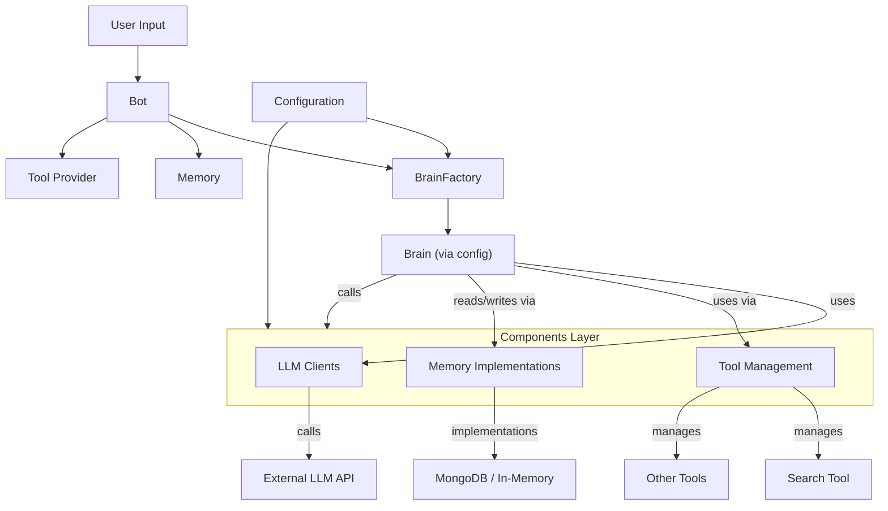
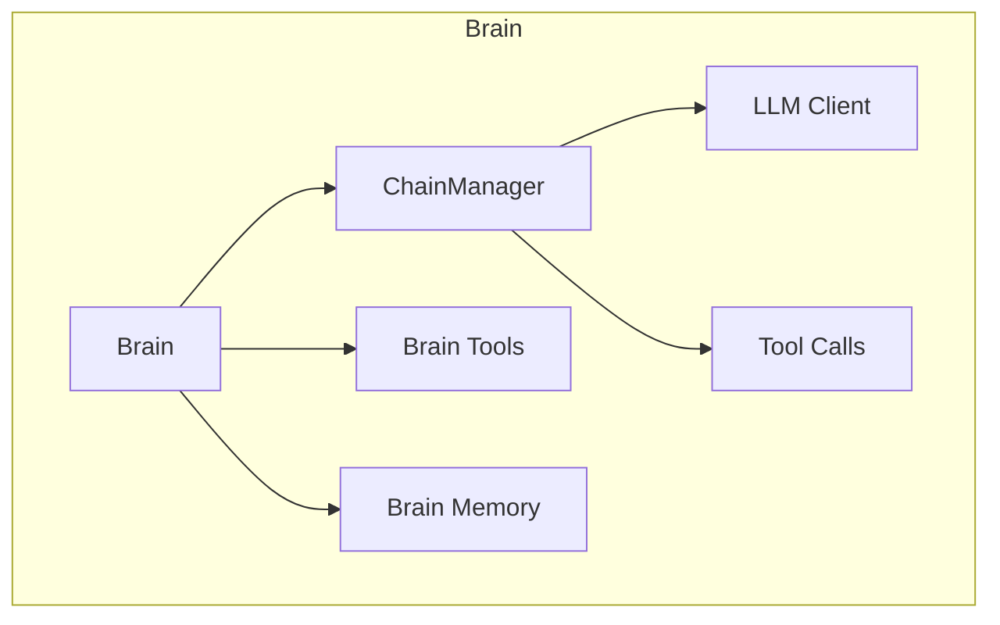

# LLM Chatbot Backend Framework

- A modular backend framework for building AI chat applications powered by large language models (LLMs), using FastAPI and MongoDB
- A flexible template that incorporates the latest techniques and best practices for building production-ready chatbots

📚 **Developer docs available in the [docs/](./docs/) folder.**


## Project Structure

The project is organized using a layered Bot-Brain architecture with a modular Components Layer:

```
├── api/                  # API layer with FastAPI
│   ├── v1/               # Versioned APIs
│   │   ├── chat.py       # Chat endpoints
│   │   ├── health.py     # Health check endpoints
│   │   └── __init__.py   # API initialization
│   ├── middleware/       # API middleware components 
│   ├── app.py            # API application configuration
│   └── routes.py         # API route definitions
├── src/                  # Source code
│   ├── bot.py            # Main Bot class (orchestrates components)
│   ├── chat_engine.py    # Chat engine implementation
│   ├── reasoning/        # Reasoning components
│   │   ├── brains/       # LLM-powered reasoning
│   │   │   ├── base.py   # BaseBrain abstract class
│   │   │   ├── brain_factory.py # Factory to choose correct brain
│   │   │   ├── services/ # Brain service implementations
│   │   │   │   ├── agent_brain.py # Agent-based brain implementation
│   │   │   │   └── llm_brain.py # Base LLM brain implementation
│   │   │   └── __init__.py # Brain module initialization
│   ├── components/       # Components Layer: modular, interchangeable units
│   │   ├── llms/         # LLM client components
│   │   │   ├── base.py   # BaseLLMClient abstract interface
│   │   │   ├── llm_factory.py # Factory for LLM clients
│   │   │   └── clients/  # Implementations for different LLM providers
│   │   │       ├── openai_client.py  # OpenAI API client
│   │   │       ├── azure_openai_client.py # Azure OpenAI API client
│   │   │       ├── llamacpp_client.py # LlamaCpp client
│   │   │       └── vertex_client.py # Google Vertex AI client
│   │   ├── memory/       # Memory persistence components
│   │   │   ├── base.py   # BaseChatbotMemory abstract interface
│   │   │   ├── memory_factory.py # Factory for memory implementations
│   │   │   └── clients/  # Memory storage implementations
│   │   │       ├── in_memory.py # In-memory implementation
│   │   │       └── mongodb_memory.py # MongoDB implementation
│   │   └── tools/        # Tool components for agent capabilities
│   │       ├── base.py   # BaseTool abstract interface
│   │       ├── serp.py   # Search tool implementation
│   │       └── __init__.py # Tool components initialization
│   └── common/           # Shared utilities and models
│       ├── config.py     # Configuration management
│       ├── models.py     # Data models
│       ├── schemas.py    # Schema definitions
│       ├── exceptions.py # Custom exceptions
│       └── logging.py    # Logging setup
├── configuration/        # Configuration files and settings
├── tests/                # Test directory
│   ├── api/              # API tests
│   │   └── test_chat.py  # Chat endpoint tests
│   ├── llm_clients/      # LLM client tests
│   │   └── test_base_llm_client.py # Base LLM client tests
│   ├── tools/            # Tool tests
│   │   ├── test_base_tool.py # Base tool tests
│   │   └── test_serp_tool.py # Search tool tests
│   ├── conftest.py       # Test configuration
│   └── test_cli.py       # CLI tests
├── docs/                 # Documentation
├── app.py                # FastAPI application
├── cli.py                # Command-line interface for local testing
├── Dockerfile            # Docker configuration
└── requirements.txt      # Project dependencies
```

## Architecture

The application follows a Bot-Brain architecture with standardized interfaces:

1. **Bot Layer** - Handles request processing and message coordination
   - A single `Bot` class delegates reasoning to a pluggable `Brain`
   - Manages memory and conversation state

2. **Reasoning Layer** - Responsible for LLM-based reasoning
   - **Brains**: Each brain implementation encapsulates reasoning logic
     - Created by a factory based on configuration
     - Follows a common interface defined by `BaseBrain`

3. **Components Layer** - Reusable components for building chatbot systems
   - Modular design with standardized interfaces
   - Manages LLM client implementations through the `BaseLLMClient` interface
   - Handles memory persistence with `BaseChatbotMemory` implementations
   - Manages tool integrations through the `BaseTool` interface and `ToolProvider`
   - Enables easy extension and replacement of functional components


## Bot-Brain Architecture Diagram



### Brain Composition Detail




## Getting Started

### Prerequisites

- Python 3.9+
- MongoDB (for persistent memory)

### Installation

1. Clone the repository
2. Install dependencies:
   ```
   pip install -r requirements.txt
   ```
3. Set up environment variables:
   ```
   # For OpenAI
   OPENAI_API_KEY=your_openai_key
   MODEL_TYPE=OPENAI
   
   # For Azure OpenAI
   AZURE_API_KEY=your_azure_openai_key
   AZURE_ENDPOINT=your_azure_endpoint
   AZURE_DEPLOYMENT_NAME=your_deployment_name
   MODEL_TYPE=AZUREOPENAI
   
   # Database
   MONGO_URI=your_mongodb_uri
   ```

### Running the Application

```
python app.py
```

The API will be available at http://localhost:8080

### Using the CLI Interface

For quick testing without running the API server, you can use the command-line interface:

```bash
# Basic usage
python cli.py

# Specify a model type
python cli.py --model llama

# Use Azure OpenAI
python cli.py --model azureopenai

# Specify a custom conversation ID
python cli.py --conversation-id my_session_123
```

Exit the CLI by typing 'exit', 'quit', or pressing Ctrl+C.
